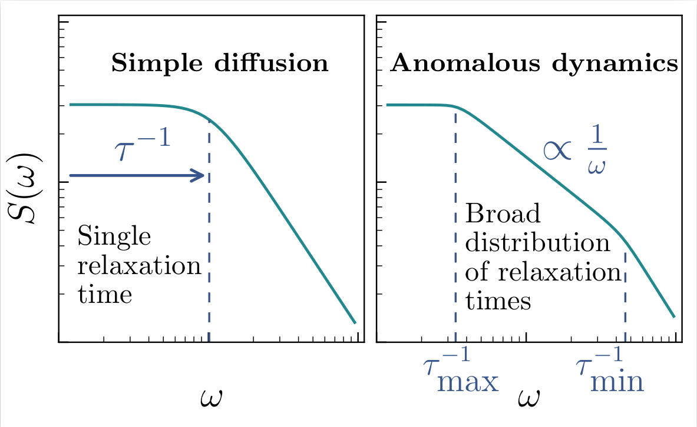

# Phenomenology of Spectral Functions in Disordered Spin Chains at Infinite Temperature

L. Vidmar, B. Krajewski, J. Bon&ccaron;a, and M. Mierzejewski

[Phys. Rev. Lett. 127, 230603 (2021)](https://journals.aps.org/prl/abstract/10.1103/PhysRevLett.127.230603)

[arXiv: cond-mat/2105.09336](https://arxiv.org/abs/2105.09336)

